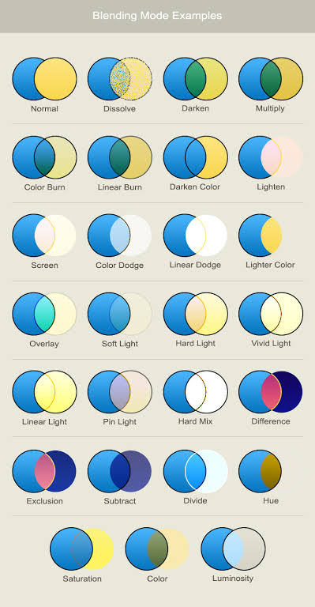

# Приоритеты

1. Ежедневная работа: сохранение настроек кисти и свои пресеты, жесты и радиальное меню, заливка, трансформация, alpha lock и clipping mask.
2. Пипетка с превью, Color Wheel в OKLCH с gamut mask, сглаживание как в Paint Tool SAI.
3. Фреймы на холсте и фильтрация слоёв.
4. Референсы.
5. Запись сессии → таймлапс → трансляция.
6. Векторные слои, слои с назначением, потом решить, нужны ли линейки на растре.
7. Градиент, PSD.

Параллельно: инфраструктура i18n и встроенные превью, по мере появления UI.

Сквозное требование: каждая новая фича делается отдельным модулем (см. «Модульность»).

# Модульность

Очень важно. Из фич-модулей должно быть можно собирать разные программы для рисования под разные задачи и разных пользователей, как в PDF Panorama. Каждый модуль поддерживается и развивается отдельно.

Сейчас модульна только часть: storage, renderer, обработчики штрихов и движки кистей подключаются JSX-провайдерами в рецепте (`StudioApplication.tsx`). Слои, выделение, симметрия, пипетка и вставка картинок встроены в `paintRuntime.ts` и в закрытый union команд `protocol.ts`. Новая фича (заливка, трансформация, референсы) сейчас требует правки протокола, runtime и `PaintStudio.tsx`.

Что нужно:

- Фича — пара половин: часть для рецепта движка (worker или main thread) и UI-часть для студии. Обе подключаются JSX в своей сборке; программа без модуля просто его не подключает.
- Расширяемые команды и события вместо закрытого union: модуль регистрирует свои команды под своим именем. `brush-command` с `command: unknown` — уже прообраз такого механизма.
- Документ и файл `.paint` должны поддерживать данные модулей: типы слоёв (вектор, анимация), фреймы, референсы. Сборка без модуля открывает такой файл, сохраняет чужие данные без изменений и показывает заглушку.
- Undo/redo, автосохранение, экспорт и LOD — общие сервисы, которые модули используют, а не реализуют заново.
- Начать с вынесения уже встроенной фичи (например, симметрии или выделения) — на ней проверить границы, потом делать новые фичи сразу модулями.
  - Сделано для симметрии: `defineDocumentFeature` + `<DocumentFeatures>` в рецепте, общая команда `{ type: 'feature' }`, данные модулей в документе (`features`), чужие данные сохраняются без изменений. UI-половина пока подключается в `PaintStudio.tsx` вручную; расширяемость UI студии и вынесение выделения/слоёв — следующие шаги.
- Проверка: вторая минимальная сборка (например, скетчбук без ABR и слоёв) в тестах, чтобы зависимости между модулями не прорастали незаметно.

# Кисти

## Настройки и пресеты

Сейчас параметры кисти сбрасываются при перезагрузке. Нужно сохранять текущие настройки и давать сохранять свои пресеты.

Решено делать через переработку кистей: кисть = пресет из библиотеки, ластик — режим, минимальная ежедневная панель. Подробности — в [TODO-brushes.md](TODO-brushes.md).

## Сглаживание

Взять за образец стабилизатор Paint Tool SAI — лучшее сглаживание из всех программ, что я пробовал. У нас уже есть Studio и Leonardo normal/smooth, надо сравнить ощущения с SAI и подобрать алгоритм.

Кандидат для сравнения сделан: режим «Stabilizer (SAI-like)» (`stabilizerStroke.ts`) — перо пересэмплируется на 120 Гц, гауссово среднее последних тиков, уровни S-1…S-20; пока перо стоит, линия догоняет его, как в SAI. Работает и для ABR-пресетов. Осталось: сравнить с SAI на планшете и подстроить шкалу уровней, веса и догонку.

Rope-режим из Lazy Nezumi не нужен.

## Инструменты для рисования

Нужны также инструменты для рисования.

## Заливка

Bucket: допуск, расширение границы, источник «все слои / текущий слой / референс-слой». Позже — закрытие щелей в лайн-арте.

Сделано модулем `features/fill` (движок — `fillEdit` на `defineDocumentEdit`, UI — `createFill` и `FillPanel`): инструмент Fill (G), допуск, расширение, непрозрачность, источник «все слои / активный слой», заливка в пределах видимой области (не больше 4096 px вокруг точки; если залитое упирается в этот предел — отказ с просьбой приблизить). Ограничение выделением сделано: с лассо заливка не выходит за выделение. Закрытие щелей сделано (Close gaps, до 32 px), сглаживание края тоже (Smooth edges). Осталось: референс-слой как источник, заливка в новый слой под лайн-артом.

## Градиент

Линейный и радиальный, с учётом Smooth color.

Сделано модулем `features/gradient` (движок — `gradientEdit`, UI — `createGradient`, `GradientPanel`, `GradientPreview`): инструмент Gradient, протяжка с превью, линейный/радиальный, основной → фоновый (или наоборот) или → прозрачный, непрозрачность, Smooth color/Classic, дизеринг, внутри лассо или по видимой области (до 4096 px), alpha lock, один шаг undo. Редактор цветовых точек сделан (до 16 точек, цвет основной/фоновый/свой, непрозрачность, пресеты, разворот). Повторение/отражение, угловой и ромбовидный сделаны. Осталось: градиент в маску.

# Color Picker

Сделано (`features/color`, выборка — `colorSample.ts` в paint-core):

- ~~превью: кольцо, где верхняя половина — цвет под курсором, нижняя — текущий цвет~~ — кольцо 120 px вокруг касания, пока оно удерживается; цвет берётся из последнего кадра по мере движения, при отпускании — точно и применяется;
- ~~временная пипетка по удержанию Alt или долгому нажатию пальцем~~ — Alt + нажатие с кистью, удержание пальцем; обе протягиваются до отпускания;
- ~~источник: все слои или только текущий слой~~ — переключатель в панели цвета;
- ~~усреднение по области 3×3 / 5×5~~.

~~Превью при наведении пера с зажатым Alt (без касания)~~ — сделано: кольцо показывается, пока Alt зажат и перо или мышь над холстом.

По отзыву с планшета (2026-10-04): пипетка удержанием пальцем убрана (палец закрывает точку); кнопка пипетки — под кругом цвета, одно нажатие; пока пипетка взведена, кольцо следует за пером при наведении; в кольце — лупа с квадратом замера.

Нужно сделать Color Wheel получше и несколько вариантов, типа Coolorus 2 с цветовым кругом. Главное в Coolorus — gamut mask и гармонии. Строить колесо в перцептивном пространстве (OKLCH), чтобы яркость не скакала при смене оттенка.

Первая версия сделана модулем `features/color-wheel`, переключатель Square/Wheel в панели цвета: круг в OKLCH (тон по кругу, насыщенность — доля максимальной хромы sRGB при этой светлоте, светлота — ползунок), гармонии (дополнительная, аналоговая, триада, расщеплённая, квадрат) точками на круге, gamut mask по Гёрни (триада, расщеплённая, дополнительная, квадрат, атмосферная) с поворотом за ручку; цвет вне маски притягивается к её границе. Свои формы маски сделаны: вершины маски перетаскиваются, и она становится Custom; точка в середине ребра добавляет вершину (до 16), двойной тап по вершине удаляет её (не меньше 3). Осталось: несколько масок, треугольник/квадрат светлоты-насыщенности внутри круга как в Coolorus, палитра гармонии в один тап.

# Трансформация

Масштаб, поворот, отражение, искажение выделения или слоя. Сейчас lasso только перемещает.

Первая версия сделана модулем `features/transform` (движок — `transformEdit`, UI — `createTransform`, `TransformOverlay`, `TransformActions`): кнопка Transform на тулбаре или ⌘/Ctrl+T трансформирует выделение, а без него — весь активный слой. Рамка по границам содержимого: перетаскивание внутри — сдвиг, угловые ручки — пропорциональный масштаб от противоположного угла (Shift — свободный), боковые — по одной оси, круглая ручка — поворот (Shift — шаг 15°); Flip, поворот на 90°, Reset, Cancel (Esc, Undo), Done (Enter, смена инструмента). Во время правки выделенные пиксели «плавают»: рендерер каждый кадр вырезает их из слоя и рисует по матрице рамки на GPU (`FloatingPixels` в paint-core, `context.floating` у правок документа), документ не меняется до Done; Done один раз пересчитывает результат билинейно (или nearest для пиксель-арта), вся трансформация — один шаг undo. Пока двигаешь рамку, она и панель скрыты. Искажение/перспектива сделаны: кнопка Distort, углы двигаются независимо, пиксели следуют в перспективе (гомография на GPU-превью и при пересчёте). Бикубическая интерполяция при Done сделана. Числовой ввод (размер, угол, сдвиг) сделан. Точка опоры сделана (перетаскиваемый маркер). Warp сделан: кнопка Warp, сетка 4×4 точек бикубического патча Безье как в Photoshop (угол тянет соседние точки края), превью сеткой 32×32 на GPU, при Done — сетка треугольников на CPU. Осталось: пресеты warp (арка, флаг и т. п.) и более плотная сетка, области больше 4096 px, трансформация нескольких слоёв.

# Vector Graphics

Очень важно иметь инструменты для создания чёткого лайн-арта. Инструменты векторной графики могут использоваться для масок, рисования сетки перспективы, заливок, скетчинга и т. д.

Идея: векторный штрих хранит центральную линию с давлением и наклоном и растеризуется той же кистью при любом зуме (как векторные слои в Clip Studio). Нужно:

- редактирование контрольных точек и толщины;
- векторный ластик, который режет штрих до пересечения;
- прямые, эллипсы, перспектива, концентрические линии;
- заливка по контурам векторного слоя.

Линейки и привязки на растровом слое — решить после векторных инструментов, возможно, они не понадобятся.

# Слои

## Alpha lock и clipping mask

Базовые вещи для покраски. Маски слоя — позже.

Alpha lock сделан: свойство слоя `alphaLock` (замок в панели слоёв), штрихи round/textured/ABR и заливка перекрашивают только непрозрачные пиксели, сохраняя их альфу; ластик на таком слое ничего не делает. Clipping mask сделан: свойство слоя `clipping` (кнопка «Clip to layer below»), обрезанный слой виден только там, где есть пиксели его базы — ближайшего необрезанного слоя снизу (альфа умножается на собственную альфу базы, без её прозрачности); скрытая база скрывает группу. Учитывается на экране, в Merge Down и в заливке по всем слоям; пока не учитывается в выборке Smudge/Mixer по всем слоям.

## Слои с назначением

Слои или группы слоёв должны иметь своё назначение:

- слой для скетчей — только инструменты для скетчей; не попадает в экспорт, по умолчанию полупрозрачный;
- слой для покраски — кисти для покраски и расширенный Color Wheel;
- векторный слой — без растровых инструментов;
- слой для анимации — timeline;
- и т. д.

Так UI не будет перегружен: пользователю доступны только те инструменты, которые ему сейчас нужны. Не превращать приложение в Photoshop, где панели занимают больше места, чем холст.

Идея: если взять инструмент другого типа (например, векторное перо на растровом слое), создавать или выбирать слой нужного типа, а не блокировать инструмент.

## Слои на бесконечном холсте

Много рисунков на одном холсте будут требовать много слоёв, и окно со слоями превратится в бесконечный список.

- ~~Скрывать в панели слои, тайлов которых нет на экране, кроме выбранного. Не перестраивать список во время движения камеры, только после остановки. Показывать, сколько слоёв скрыто. Новые пустые слои не скрывать.~~ — сделано: `createLayerFilter` в `features/layers`, движок сообщает слои в кадре (`layersInView` в paint-core), список обновляется через 300 мс после остановки камеры, кнопка под списком показывает скрытые.
- Фреймы (artboards): именованный прямоугольник на холсте. Заменяет региональные и проектные группы: панель слоёв показывает слои активного фрейма, PNG экспортирует фрейм, ссылкой можно поделиться на фрейм, к фрейму можно перейти.
  - Первая версия сделана модулем `features/frames` (данные документа `framesFeature`, блок вверху панели слоёв, контуры на холсте): новый фрейм по текущему виду, выбор активного фрейма с переходом к нему, переименование, удаление, PNG фрейма в 100% (до ~8 Мп), ссылка `#frame=<id>` — пока только на этом устройстве, общих ссылок нет. Прямоугольник фрейма меняется ручками на холсте (кнопка Adjust). Фрейм из выделения сделан: New frame с лассо берёт его границы. Осталось: экспорт в другом масштабе, ссылки для других людей (нужна сеть), изменение фреймов как шаг undo.
- Фильтры слоёв.
- Может быть: при отдалении показывать слои в регионах, чтобы их можно было переносить между регионами.

# Референсы

Картинка, которая не является слоем и не растрируется в тайлы, что-то вроде smart object из Photoshop:

- два режима: закреплена на экране или закреплена на холсте;
- хранит оригинал, разрешение холста не влияет на её разрешение;
- тайлы, level of detail, виртуальные страницы и вытеснение, как у основного холста, чтобы много больших референсов не съедали RAM и GPU-память;
- прозрачность, отражение, ч/б.

# Жесты и быстрый доступ

На планшете клавиатуры нет:

- ~~тап двумя пальцами — undo, тремя — redo, удержание пальцем — пипетка~~ — сделано (пипетку удержанием потом убрали, см. Color Picker) (`touchGestures` в `attachInput`: тап короче 350 мс без сдвига больше 10 px, удержание 500 мс; камера после тапа возвращается к исходной);
- ~~радиальное меню под перо~~ — сделано модулем `features/radial-menu`, вместе с навигационной шайбой: боковая кнопка пера (правый клик), Space или V открывают уменьшенную шайбу (120 px) с кольцом действий — кисть, ластик, заливка, лассо, трансформация, undo/redo, пипетка и три недавних пресета. Нажатие на действие или жест «нажал кнопку пера → повёл к действию → отпустил». Дальше: настраиваемые слоты, свои действия модулей.

# Сеть и совместная работа

Как минимум надо сделать так, чтобы свой текущий холст можно было отдать одноразовой или постоянной ссылкой, чтобы другие могли смотреть, как художник рисует в реальном времени. Передавать позицию пера (с наклоном, нажимом и hover), мыши, пальцев и камеры, чтобы зрители видели сам процесс.

Начать с записи сессии: лог входных событий плюс периодические снимки тайлов. Из неё получаются таймлапс, трансляция (тот же поток в реальном времени) и воспроизводимые баги и бенчмарки. Зрителю нужно передать ресурсы кистей. Точное повторение на другом GPU не гарантировано, поэтому снимки тайлов — контрольные точки.

Первый шаг сделан: запись ввода для воспроизведения багов модулем `features/recording` (Developer → Record input…, только на dev-сервере): события пера, касаний, мыши и клавиатуры с coalesced-сэмплами, команды документа, изменения состояния редактора, снимок рисунка `.paint` и кадры вида в начале и в конце; `scripts/recording-timeline.mjs` печатает хронологию. Дальше: кольцевой буфер «последняя минута», воспроизведение через Playwright со скриншотами, записи как регрессионные тесты.

# PSD

Импорт и экспорт, отдельным пакетом, как ABR (`abr-parser` / `abr-paint`).

Первая версия сделана: пакет `@app-game/psd` (`readPsd` / `writePsd`, 8-битный RGB, растровые слои, PackBits), мост в paint-core — `psdFile.ts`. Drawing menu → Export layers сохраняет все слои области с рисунком, кнопка PSD у фрейма — слои фрейма; Open drawing открывает `.psd` (холст — в начале координат, вид вписывается). Сохраняются имена (Unicode), видимость, непрозрачность, режимы Normal/Multiply/Screen/Overlay (Smooth color уходит как Normal), clipping, alpha lock; плоское изображение для программ без слоёв. Осталось: группы (сейчас при импорте раскрываются), маски слоёв, ZIP-сжатие, 16 бит, CMYK/Grayscale, PSB, остальные режимы смешивания.

# i18n

Добавить переводы на популярные языки. Основной остаётся английский:

- русский, немецкий, испанский, французский, португальский, сербский (только латиница);
- японский, китайский, корейский;
- арабский, иврит (для проверки RTL);
- хинди, бенгальский — под вопросом.

Нужны ICU-плюрализация и логические CSS-свойства для RTL. Инфраструктуру строк завести сейчас, пока панелей мало.

Но в основном надо полагаться на инфографику — иконки, превьюшки и т. д.

# UI/UX

Для различных инструментов надо показывать, как они работают. Например, dropdown режима смешивания должен показывать на простых примерах (может быть, на кружочках), как будут выглядеть Normal, Dissolve, Darken, Multiply.

Превью рендерить тем же GPU-шейдером, что и холст, а не картинками, чтобы они совпадали с реальным результатом, включая Smooth color.

Сделано для режимов наложения слоя: вместо выпадающего списка — кнопки с превью двух перекрывающихся кругов (мягкий синий над оранжевым), сведённых `mergeTilePixels` — CPU-портом композитинга холста, сверенным с шейдером GPU-проверкой `layer-merge`, так что превью совпадают с холстом, включая Smooth color. Дальше — такие же превью для других настроек (кисти, режимы заливки).

Так это ускорит поиск нужного инструмента. Задача — чтобы людям не нужны были cheat sheets: все cheat sheets встроены прямо в программу.
