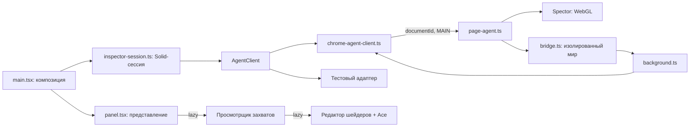

# Архитектура WebGL Spector DevTools

Ревью охватывает расширение, используемые им части `packages/spector` и интерфейс
`packages/webgl-debug`. Изменения сохраняют Solid 2. Chrome, состояние панели и WebGL
теперь имеют отдельных владельцев. Это особенно важно при навигации и закрытии панели:
результат асинхронной операции может прийти после исчезновения её документа или Solid owner.

## Что изменено



| Модуль | Что скрывает его интерфейс |
| --- | --- |
| `inspector-session.ts` | Историю, выбор canvas, поколения запросов, объединение параллельных загрузок, повтор передачи, принадлежность живых ресурсов и освобождение подписок. |
| `chrome-agent-client.ts` | Инъекцию, сериализацию, проверку документа ответа, восстановление подключения к worker и события навигации. |
| `protocol.ts` | Типы команд и единые проверки сообщений для страницы, изолированного bridge, worker и панели. Тип аргументов и результата вызова выводится из выбранной команды. |
| `page-agent.ts` | Вооружение захвата, ожидание WebGL-вызовов, запись, публикацию результата, доступ к живым ресурсам и освобождение Spector. |
| `panel.tsx` | Только отображение состояния сессии и пользовательские действия. Здесь нет Chrome API, таймеров и карт ревизий. |
| `solid/shader-editor.tsx` | Ace, редактирование источников, задержку компиляции и отображение ошибок. Детали команды передаются как JSX, без обратного импорта просмотрщика. |

`AgentClient` — полезный seam: в production используется Chrome-адаптер, в тестах —
управляемый адаптер с задержками и ошибками. Тесты проходят через интерфейс сессии,
а не вызывают её внутренние функции.

### Инварианты

- Источник захвата определяется парой `documentId + captureRevision`. URL служит подписью.
- `frameId` нужен для отображения и проверки сообщения, но переживает замену документа.
- Ответ прошлого поколения запросов не меняет состояние нового поколения.
- Передача считается завершённой только после чтения и проверки JSON. Одновременные
  push и polling используют один запрос; после ошибки следующий poll повторяет передачу.
- История сохраняет снимки после навигации. Живые операции проверяют наличие исходного
  документа, а агент дополнительно проверяет ревизию для компиляции.
- Solid owner освобождает подписки и polling. Агент страницы живёт до замены или уничтожения
  документа, чтобы закрытие панели не прерывало работу инспектируемого приложения.
- Старый агент без `dispose` требует reload страницы. Новые версии освобождают свои перехватчики
  перед заменой; повторная установка той же версии ничего не меняет.

Выбор документа и ожидание асинхронных результатов основаны на
[chrome.scripting](https://developer.chrome.com/docs/extensions/reference/api/scripting),
а различие frame и document — на
[chrome.webNavigation](https://developer.chrome.com/docs/extensions/reference/api/webNavigation).

### Solid 2

Сессия использует `createSignal` для изменяемого состояния и `createMemo` для производных
значений. Жизненный цикл ограничен `onSettled` и `onCleanup`. Сигналы остаются рядом с
поведением, которое ими управляет; дополнительное глобальное хранилище здесь не требуется.
В интерфейсе условные классы используют массивы и объекты в `class`, асинхронные модули —
`lazy` и `Loading`. Просмотрщик принимает текущий захват вместе с запросом компиляции,
поэтому его владелец может определить правильный документ.

## Что ещё стоит разделить

1. **Политики восстановления сцены и выполнение WebGL.** В
   `packages/spector/backend/utils/sceneCapture.ts` выбор уникальных проходов, определение
   камеры, подбор материала и чтение GPU находятся рядом. Выделить чистую политику выбора
   сцены, оставив выполнение за модулем чтения ресурсов. Существующие тесты эвристик перенести
   к этой политике; добавить проверки бюджетов и отказов через интерфейс сборки сцены.

2. **Временное GPU-состояние.** `meshShaderReplay.ts` и `textureCapture.ts` отдельно сохраняют
   привязки, создают шейдеры и удаляют временные ресурсы. Их состояния различаются, поэтому
   объединять списки параметров в один универсальный helper преждевременно. Сначала нужны
   браузерные проверки восстановления состояния при успехе и ошибке. После этого можно
   выделить модуль временных ресурсов с обязательным освобождением через `finally`.

3. **Оставшиеся вкладки просмотрщика.** После выделения редактора в
   `solid/spector-result-view.tsx` всё ещё находятся texture gallery, mesh inspector,
   история и JSON-дерево. Следующие самостоятельные модули — mesh inspector и texture gallery:
   у них уже есть свои запросы, состояния загрузки и очистка. Родитель должен хранить только
   выбранный захват, вкладку и команду. Общие визуальные детали стоит выделять по реальному
   повторному использованию, без большого файла `utils`.

4. **Единое владение перехватчиками.** `CanvasSpy`, `TimeSpy`, `OriginFunctionHelper` и
   `webgl-debug` используют разные механизмы обёрток. В этой правке добавлено освобождение
   `CanvasSpy`, но механизмы ещё не объединены. Перед унификацией проверить сосуществование
   нескольких инспекторов, OffscreenCanvas и сторонних обёрток `getContext`. Общий модуль
   должен оставаться независимым от Solid, Chrome и формата захвата.

5. **Публичные точки входа Spector.** Корневой `index.tsx` экспортирует движок, UI и демонстрации.
   Расширение теперь использует отдельные runtime-входы движка и просмотрщика; типовые импорты
   стираются при сборке. Остальные потребители можно постепенно перевести на такие же входы.
   Разделять workspace-пакет физически пока не требуется: важнее проверяемое направление
   зависимостей и отсутствие UI в сборке агента.

Это следующие изменения, а не уже завершённый рефакторинг GPU-движка. Новая структура
расширения позволяет выполнять их отдельно, не затрагивая Chrome-транспорт и историю.

## Проверка

```sh
pnpm --filter @app-game/webgl-spector-devtools test
pnpm --filter @app-game/spector test
pnpm --filter @app-game/webgl-spector-devtools test:browser
```

Последняя команда собирает расширение и запускает Chromium в отдельном временном профиле.
Она проверяет реальный worker, сообщения, MAIN-инъекцию и WebGL на двух одинаковых iframe URL,
захват после reload, стили выбора, результаты при 900 px и доступ к истории при 680 px.
Только сведения о выбранном DevTools tab и теме подставляются в отдельно открытую страницу
панели. Скриншоты сохраняются во временную папку, путь выводится в терминал.

Проверки не заменяют тестирование тяжёлых сцен Sketchfab, разных GPU и восстановления
контекста после `webglcontextlost`. Текущий браузерный сценарий проверяет инфраструктуру
расширения на небольшой контролируемой WebGL-странице.
